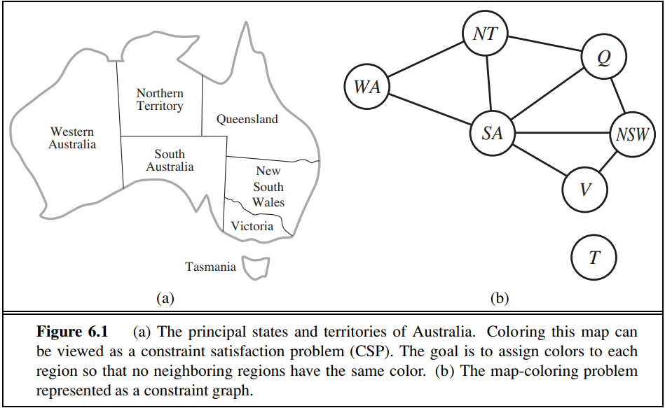
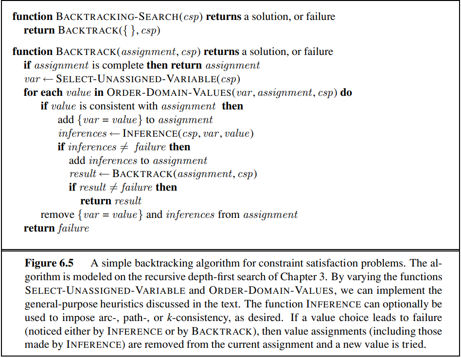
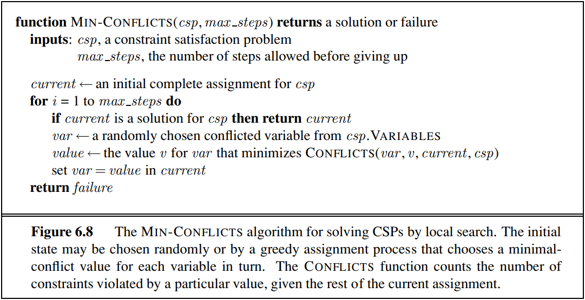
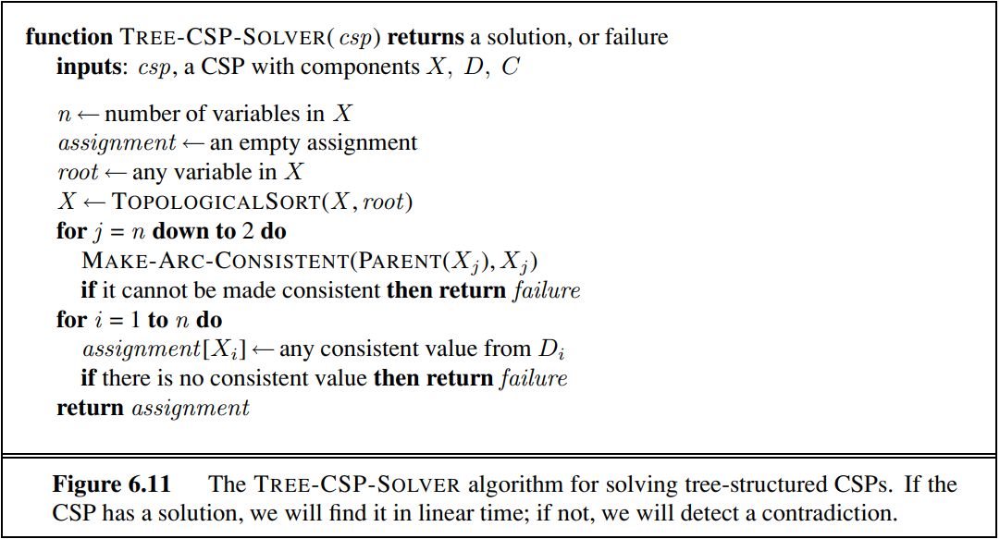

# Constraint-Satisfaction
Experimental Analysis of Algorithms - Constraint Satisfaction

## Map Coloring Problem (involves variables that have discrete, finite domains)

Constraint satisfaction problems (CSPs) represent a state with a set of variable/value
pairs and represent the conditions for a solution by a set of constraints on the variables.

X is a set of variables, {X1,...,Xn}.  
D is a set of domains, {D1,...,Dn}, one for each variable.  
C is a set of constraints that specify allowable combinations of values.  

We can visualize the map coloring CSP as a constraint graph, where:  
nodes = variables of the problem  
colors = represents the domain for each variable (node)   
edge between two nodes = connects two variables that participate in a constraint  

Types of constraints:  
- unary constraint involves a single variable (e.g.: WA != red)
- binary constraint relates two variables (e.g.: WA != SA)
- global constraint relates a constraint involving an arbitrary number of variables (e.g.: AllDiff(F, T, U, W, R, O) - all of the
variables involved in the constraint must have different values)
- preferences indicating which solutions are preferred (e.g.: red is better than green)

Backtracking Search
- depth-first search + variable ordering (e.g.: minimum-remaining-values (MRV) heuristic - it picks a variable that is most likely to cause a failure
soon) + fail when constraint is not satisfied 
- chooses values for one variable at a time and backtracks when a variable has no legal values left to assign

Backtracking Search Optimizations:
- can be improved using inference techniques that use the constraints to infer which variable/value pairs
are consistent and which are not (arc-, path-, or k-consistency)
- can be improved using heuristics

Heuristics
- The minimum-remaining-values and degree heuristics are domain-independent methods for deciding which variable to choose next in a backtracking search
- The least-constraining-value heuristic helps in deciding which value to try first for a given variable. Backtracking occurs when no legal assignment can be found for a variable
- Conflict-directed backjumping backtracks directly to the source of the problem
- Local search using the min-conflicts heuristic

  
  

<b>Another aproach</b> to solve the problem is to use local search algorithms and heuristics such as min-conflicts.   
Idea: the initial state assigns a value to every variable, and the search changes the value of one variable at a time, and the point of local search is to eliminate the violated constraints.  

  
  
 
 <b>Tree-structured CSP</b> is another way to solve the graph-coloring problem by decompose it into many subproblems. The constraint graph should be reduced to trees (any two variables are connected by only one path) based on removing nodes or based on collapsing nodes together.  
 
 

#### References: Stuart J. Russell and Peter Norvig. Artificial Intelligence: A Modern Approach, chapter 6 (Constraint Satisfaction Problems)
